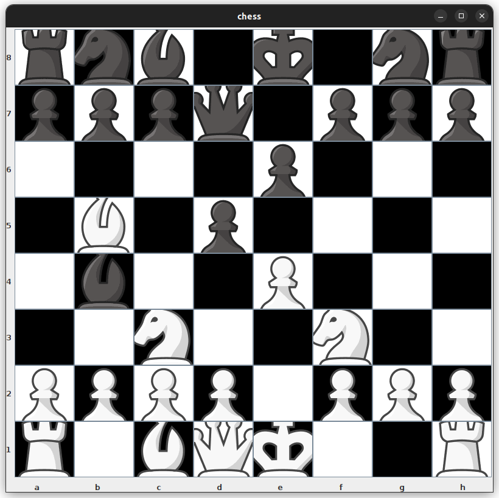
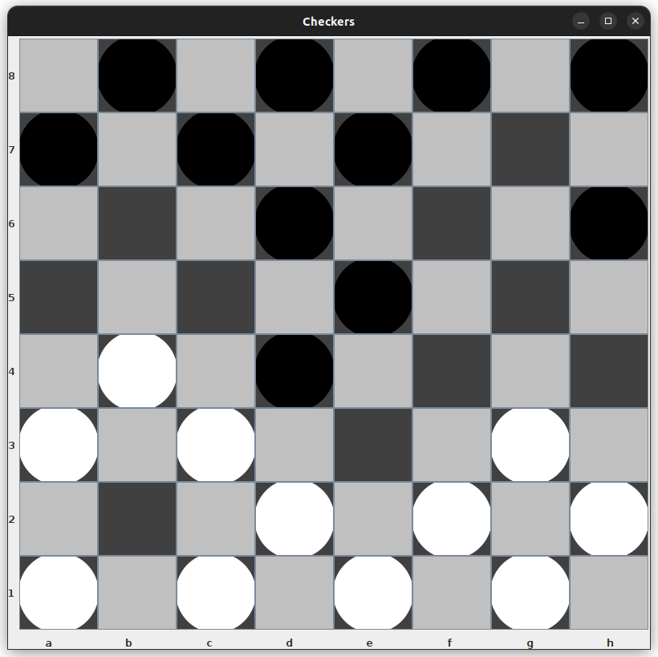
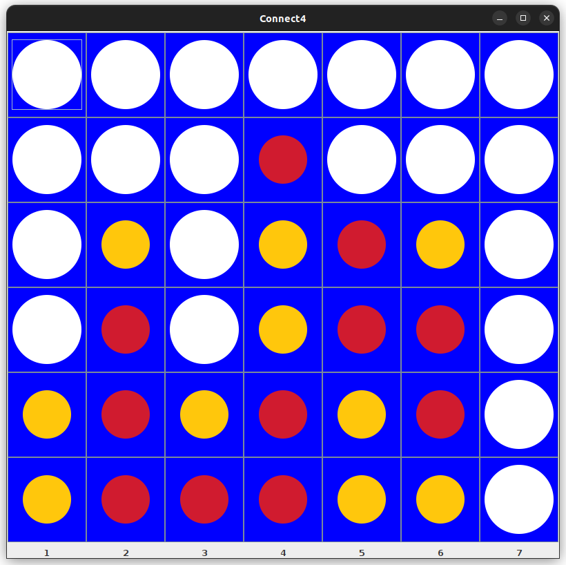
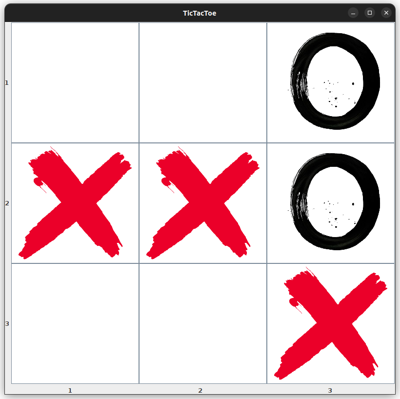
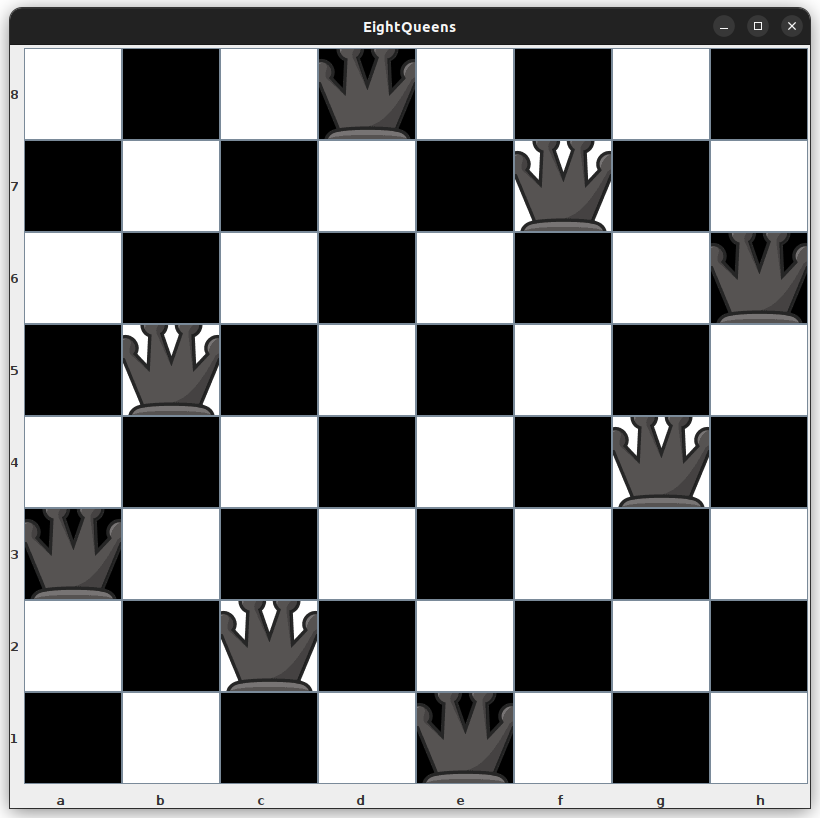
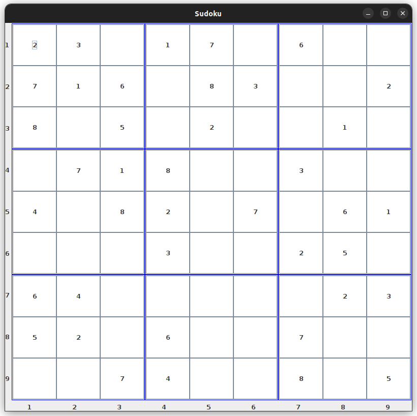

# Multi-paradigm-board-games-engine

a project for Programming Paradigms course where we implement 6 board games using different programming paradigms
** that repo is for the functional programming paradigm implementation of the project **

## features of functional programming used in the project
### Pattern Matching
- Used to deal with patterns among lists
  -
 ```
 def isColumnFull(board: Array[Array[Char]], column: Int): Boolean = {
    val columnList = board.map(_(column)).toList
    columnList match {
      case Nil => false
      case head :: tail if head != '-' => true
      case _ => false
    }
  }
  ```
  - 
```
def conflict(p: (Int, Int), queens: List[(Int, Int)]): Boolean = queens match {
    case Nil => false
    case q :: qs => threat(p, q) || conflict(p, qs)
  }
```
  
### Higher Order Functions
- Used as a layer of abstraction
- that function returns the proper functions corresponding to the chosen game 
```
def getControllerAndDrawer(gameNumber:Int)= gameNumber match{
  case 1 => (chessController,chessDrawer)
  case 2 => (checkersController,checkersDrawer)
  case 3 => (connect4Controller,connect4Drawer)
  case 4 => (XOcontroller,XOdrawwer)
  case 5 => (eightQueensController,eightQueensDrawer)
  case 6 => (sudokuController,sudokuDrawer)
  case _ => (null,null)
}
```

- that function takes the two passed functions of controller and drawer and runs the game loop
```
def GameEngine(initialState:(Array[Array[Char]],Boolean),controller:(String,(Array[Array[Char]],Boolean))=>((Array[Array[Char]],Boolean)),drawer:(JFrame,Array[Array[Char]])=>JFrame)={
  var gamestate = initialState
  var frame = new JFrame()
  frame = drawer(frame, gamestate._1)
  while (true){
    if (gamestate._2) {
      println("player1 turn in multiplayer games only")
    } else {
      println("player2 turn in multiplayer games only")
    }
    println(">>in case of Chess/Checker enter the name of initial and destination cells of the piece you want to move in the form of a2->a4\n" +
      ">>in case of TicTacToe enter the number or row followed by a comma then the number of column with no spaces in between as 2,2\n" +
      ">>in case of Connect4 enter the number of column only\n" +
      ">>in case of EightQueens enter the name of the cell to add/remove a queen in it\n" +
      ">> in case of sudoku enter the[row column value] to add a value , put them in that order [row column value]")
    val input = readLine()
    gamestate = controller(input, gamestate)
    frame = drawer(frame, gamestate._1)

  }
}
```
## ScreenShots of games
1. chess


2. checkers


3. connect4


4. tictactoe


5. 8 queens


6. sudoku

